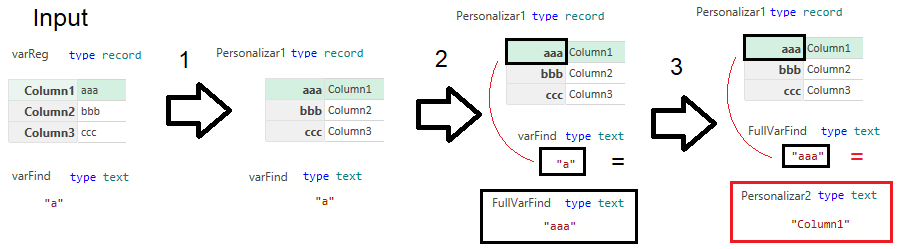
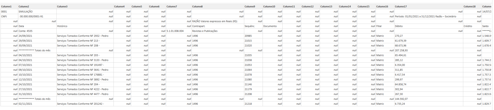
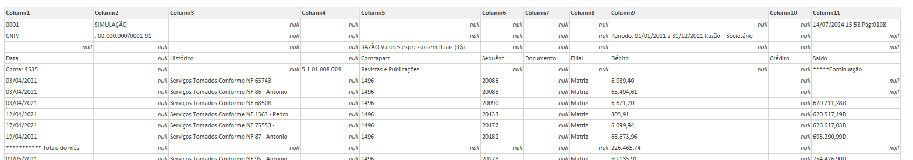
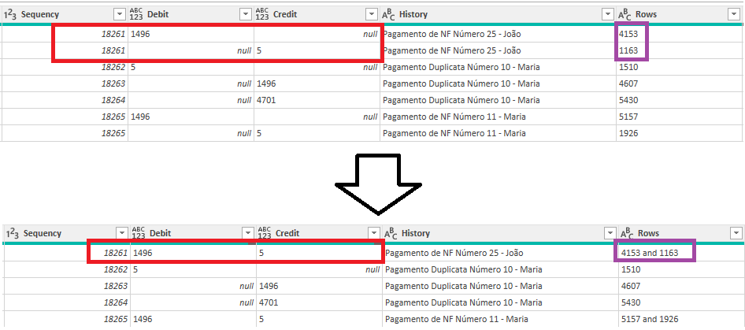

# General ledger in PDF

This folder's goal is to convert a General ledger save in the PDF format to a CSV containing.

## Requirements
* No data loss is allow.
* Each row needs to have one journal entry.
* Each row needs to have a company EIN (CNPJ), sequence #, date, debit and credit account number (integer), description, branch, and value.
* No partial solutions, the solution for this report need to work in reports of similar layout.
* No journal entry can be duplicated. If a journal entry has the same EIN, Branch, Date, Sequency Value, Sequency, Document and History and only a debit and a credit value, it can only be one journal entry.
* Keep the row of report to be able to track the source of information. (Debug and Compliance).

## Files
For this example, the "General ledger 2021.pdf" will be used as source in the "ETL.xlsx" file.

# ETL Steps

To understated the code is recommended that you download the .xlsx file and the pdf in your computer to follow step by step below.

## 1. Load File
To Load the File, is possible to do:
```
let
    Fonte = Pdf.Tables(File.Contents(Path), [Implementation="1.3"]),
    #"Linhas Filtradas" = Table.SelectRows(Fonte, each ([Kind] = "Page")),
    #"Outras Colunas Removidas" = Table.SelectColumns(#"Linhas Filtradas",{"Data"}),
    #"Data Expandido" = Table.ExpandTableColumn(#"Outras Colunas Removidas", "Data", {"Column1", "Column2", "Column3", "Column4", "Column5", "Column6", "Column7", "Column8", "Column9", "Column10", "Column11", "Column12", "Column13", "Column14", "Column15", "Column16", "Column17", "Column18", "Column19"}, {"Column1", "Column2", "Column3", "Column4", "Column5", "Column6", "Column7", "Column8", "Column9", "Column10", "Column11", "Column12", "Column13", "Column14", "Column15", "Column16", "Column17", "Column18", "Column19"}),
```

Where `Path` is the location of the PDF file. This will put all pages in the same table. One after the other.

## 2. Add Index
This step is important to allow an easier Debug of the code if any error is encounter.

```
    #"Índice Adicionado" = Table.AddIndexColumn(#"Data Expandido", "Row", 1, 1, Int64.Type),
    #"Tipo Alterado2" = Table.TransformColumnTypes(#"Índice Adicionado",{{"Row", type text}}),
```

The type transformation is important in future steps, it will allow to merge many rows if needed.

## 3. Company EIN (CNPJ)

The EIN is available in the first row of each page, this row, and only this row, has the value "CNPJ" in the `Column1`. We can use this to extract the EIN value from `Column2`. And then fill down to the other columns.

```
    #"Personalização Adicionada" = Table.AddColumn(#"Data Expandido", "EIN", each if [Column1] = "CNPJ" then Text.Replace([Column2], ": ","") else null),
    #"Preenchido Abaixo" = Table.FillDown(#"Personalização Adicionada",{"EIN"}),
```

## 4. Custom Function

To this extraction works properly 'll be needed a function that received 2 variables, one record and one text. This function will:
1. Invert the record Name with the record Value (Steps `Fonte` to `Personalizar1`);
1. Find the record Value (now record Name) that starts with a the input text (Step `FullVarFind`).
1. Retrieved the Name (now value) of the record.



With this function is possible pass a row, and a field value, and find a the column name of the searched value. The full code is shown bellow.

```
let
    Fonte = (varReg as any, varFind as any) => let
        Fonte = if Type.Is(Value.Type(varReg), type record) then varReg else [Column1="a",Column2="b",Column3="c"],
        #"Convertido para Tabela1" = Record.ToTable(Fonte),
        #"Colunas Reordenadas" = Table.ReorderColumns(#"Convertido para Tabela1",{"Value", "Name"}),
        #"Tabela Transposta" = Table.Transpose(#"Colunas Reordenadas"),
        #"Cabeçalhos Promovidos" = Table.PromoteHeaders(#"Tabela Transposta", [PromoteAllScalars=true]),
        Personalizar1 = #"Cabeçalhos Promovidos"{0},
        FullVarFind = Record.FieldNames(Personalizar1){List.PositionOf(List.Transform(Record.FieldNames(Personalizar1), each Text.StartsWith(_, varFind)), true)},
        Personalizar2 = Record.Field(Personalizar1,Text.From(FullVarFind))
    in
        Personalizar2
in
    Fonte
```

This will be needs since power query can identify the same column in different positions for each page as shown bellow.

Example Page 109:

Example Page 108:


In the first case the "Débito" column is in the `Column17`, in the second the same columns is in the position `Column9`.

## 5. Account Number

The account number appears before each journal entry for that account and it can be use for the debit ou credit. This information needs to be row by row. So we can apply the same step of the company EIN. However this time this field could be find in more than one column depending of the page. For this reason the custom function is call. The add column will have the function `try Text.Replace(Record.Field(_, FnFindColumn(_,"Conta: ")), "Conta: ", "") otherwise null`, and a fill down will be used again to propagate the account number to the other rows.

```
    #"Personalização Adicionada1" = Table.AddColumn(#"Preenchido Abaixo", "Account#", each try Text.Replace(Record.Field(_, FnFindColumn(_,"Conta: ")), "Conta: ", "") otherwise null),
    #"Preenchido Abaixo1" = Table.FillDown(#"Personalização Adicionada1",{"Account#"}),
```

## 6. Finding the data

To find the useful data between all empty columns is possible to use a the created function to save in a record all columns names for each important column. This can be done with multiple functions `Table.AddColumn`, sill doting in a single column could be more performative since only one "if" statement will be needed for each row.
```
    #"Personalização Adicionada2" = Table.AddColumn(#"Preenchido Abaixo1", "Positions", each if [Column1] = "Data" or [Column2] = "Data" or [Column3] = "Data" then [Dt = FnFindColumn(_,"Data"),Hist = FnFindColumn(_,"Histórico"), Seq = FnFindColumn(_,"Sequênc."), Doc = FnFindColumn(_, "Documento"), Fil = FnFindColumn(_, "Filial"), Deb = FnFindColumn(_, "Débito"), Cre = FnFindColumn(_, "Crédito")] else null),
    #"Preenchido Abaixo2" = Table.FillDown(#"Personalização Adicionada2",{"Positions"}),
```

Having now the correct position of each value for each row, the same principal can be used to extract the data from the correct columns.

```
    #"Personalização Adicionada3" = Table.AddColumn(#"Preenchido Abaixo2", "Columns", each [Date = Record.Field(_, [Positions][Dt]), Branch = Record.Field(_, [Positions][Fil]), History = Record.Field(_, [Positions][Hist]), Sequency = Record.Field(_, [Positions][Seq]), Document = Record.Field(_, [Positions][Doc]), DebitValue = Record.Field(_, [Positions][Deb]), CreditValue = Record.Field(_, [Positions][Cre])]),
```

## 7. Filtering Rows

This report also has empty rows, containing information form headers and footers. The steps bellow are done to keep only rows related with the report perse. The conditions listed the the `Personalização Adicionada4` step was created by trail an error, balancing removing headers and footers and keeping the core data.

```
    #"Valor Substituído" = Table.ReplaceValue(#"Personalização Adicionada3",null,"",Replacer.ReplaceValue,{"Column1", "Column2", "Column3"}),
    #"Personalização Adicionada4" = Table.AddColumn(#"Valor Substituído", "Type", each if (try Number.From([Columns][Date]) otherwise null) <> null or Text.StartsWith([Column1], "Conta") or Text.StartsWith([Column2], "Conta") or Text.StartsWith([Column3], "Conta") or [Columns][History] = "Saldo anterior..." or [Columns][History] = "*********** Totais do mês" or [Columns][History] = "*********** Totais da conta" or Text.StartsWith([Column1], "***") or Text.StartsWith([Column2], "***") then "Headers" else
        if (try Date.From([Columns][Date]) otherwise null) <> null then "Data" else  null ),
    #"Preenchido Abaixo3" = Table.FillDown(#"Personalização Adicionada4",{"Type"}),
    #"Erros Removidos" = Table.RemoveRowsWithErrors(#"Preenchido Abaixo3", {"Type"}),
    #"Linhas Filtradas1" = Table.SelectRows(#"Erros Removidos", each ([Type] = "Data")),
```

## 8. Keep important Columns

The steps below are done keep only the important columns. And Expand the Data extracted in the step **6. Finding the data**.

```
    #"Outras Colunas Removidas1" = Table.SelectColumns(#"Linhas Filtradas1",{"Row", "EIN", "Account#", "Columns"}),
    #"Columns Expandido" = Table.ExpandRecordColumn(#"Outras Colunas Removidas1", "Columns", {"Date", "Branch", "History", "Sequency", "Document", "DebitValue", "CreditValue"}, {"Date", "Branch", "History", "Sequency", "Document", "DebitValue", "CreditValue"}),
```

## 9. Combine History

Another chalenge this reports brings is the column "History" since in some cases, it has been divided in many rows. Since one of the requierment of this ETL is no data loss, it is requierd to combine this rows in one.

For this, it will be used the `Table.Group` function. Though for this code to work it is required for all other columns to have the same value. For this reason another FillDown funciont will be call first.

To avoid problemns with filling value incorrectly, the columns "DebitValue" and "CreditValue" will be grouped usgin the `List.Max` function. To allow compliance the Row columns will be cobined using the formula `Text.Combine(_[Row], "+")`. And the History fill be combined using `Text.Combine(_[History], " ")`.

```
    #"Preenchido Abaixo4" = Table.FillDown(#"Columns Expandido",{"Date", "Branch", "Sequency", "Document"}),
    #"Tipo Alterado" = Table.TransformColumnTypes(#"Preenchido Abaixo4",{{"DebitValue", type number}, {"CreditValue", type number}}),
    #"Linhas Agrupadas" = Table.Group(#"Tipo Alterado", {"EIN", "Account#", "Date", "Branch", "Sequency", "Document"}, {{"DebitValue", each List.Max([DebitValue]), type nullable number}, {"CreditValue", each List.Max([CreditValue]), type nullable number}, {"Rows", each Text.Combine(_[Row], "+"), type text}, {"History", each Text.Combine(_[History], " "), type text}}),
```

## 9. Extracting Debit and Credit

Since is needed the column Account Debit, Account Credit and Value, a simple transformation will be done and the obsolete columns will be removed.


```
    #"Personalização Adicionada5" = Table.AddColumn(#"Linhas Agrupadas", "Account", each if [DebitValue] = null then [Debit = null, Credit = [#"Account#"], Value = [CreditValue]] else [Debit = [#"Account#"], Credit = null, Value = [DebitValue]]),
    #"Colunas Removidas" = Table.RemoveColumns(#"Personalização Adicionada5",{"Account#", "DebitValue", "CreditValue"}),
    #"Account Expandido" = Table.ExpandRecordColumn(#"Colunas Removidas", "Account", {"Debit", "Credit", "Value"}, {"Debit", "Credit", "Value"}),
```
## 10. Combine Rows

The desired end format of this report, requiers that:
> If a journal entry has the same EIN, Branch, Date, Sequency Value, Sequency, Document and History and only a debit and a credit value, it can only be one journal entry.



To accomplish that another `Table.Group` will be used. And a conditional column will be created. If the group has only 2 records, they will become one, otherwise, each journal entry will be maintained.

```
    #"Tipo Alterado1" = Table.TransformColumnTypes(#"Account Expandido",{{"Date", type date}, {"Sequency", Int64.Type}}),
    #"Linhas Classificadas" = Table.Sort(#"Tipo Alterado1",{{"Sequency", Order.Ascending}}),
    #"Linhas Agrupadas1" = Table.Group(#"Linhas Classificadas", {"EIN", "Branch", "Date", "Sequency", "Value", "History", "Document"}, {{"Rows", each Text.Combine(_[Rows], " and "), type text}, {"All", each _, type table [EIN=text, Branch=text, Date=nullable date, Sequency=nullable number, Debit=nullable text, Credit=nullable text, Value=number, History=text, Document=any]}, {"Count", each Table.RowCount(_), Int64.Type}}),
    #"Linhas Classificadas1" = Table.Sort(#"Linhas Agrupadas1",{{"Sequency", Order.Ascending}}),
    #"Personalização Adicionada7" = Table.AddColumn(#"Linhas Classificadas1", "Reg", each if [Count] = 2 then Table.FromRecords({[Debit = List.Max([All][Debit]), Credit = List.Max([All][Credit])]}) else [All]),
    #"Reg Expandido" = Table.ExpandTableColumn(#"Personalização Adicionada7", "Reg", {"Debit", "Credit"}, {"Debit", "Credit"}),
```
## 11. Column Order
Now, it is just a matter of removing unwanted columns, and putting the data in a more common order.
```

    #"Outras Colunas Removidas2" = Table.SelectColumns(#"Reg Expandido",{"EIN", "Branch", "Date", "Sequency", "Debit", "Credit", "Value", "History", "Document", "Rows"})
in
    #"Outras Colunas Removidas2"
```

# Final Code

Custom Function:

```
let
    Fonte = (varReg as any, varFind as any) => let
        Fonte = if Type.Is(Value.Type(varReg), type record) then varReg else [Column1="a",Column2="b",Column3="c"],
        #"Convertido para Tabela1" = Record.ToTable(Fonte),
        #"Colunas Reordenadas" = Table.ReorderColumns(#"Convertido para Tabela1",{"Value", "Name"}),
        #"Tabela Transposta" = Table.Transpose(#"Colunas Reordenadas"),
        #"Cabeçalhos Promovidos" = Table.PromoteHeaders(#"Tabela Transposta", [PromoteAllScalars=true]),
        Personalizar1 = #"Cabeçalhos Promovidos"{0},
        FullVarFind = Record.FieldNames(Personalizar1){List.PositionOf(List.Transform(Record.FieldNames(Personalizar1), each Text.StartsWith(_, varFind)), true)},
        Personalizar2 = Record.Field(Personalizar1,Text.From(FullVarFind))
    in
        Personalizar2
in
    Fonte
```

ETL:

```
let
    Fonte = Pdf.Tables(File.Contents(Path), [Implementation="1.3"]),
    #"Linhas Filtradas" = Table.SelectRows(Fonte, each ([Kind] = "Page")),
    #"Outras Colunas Removidas" = Table.SelectColumns(#"Linhas Filtradas",{"Data"}),
    #"Data Expandido" = Table.ExpandTableColumn(#"Outras Colunas Removidas", "Data", {"Column1", "Column2", "Column3", "Column4", "Column5", "Column6", "Column7", "Column8", "Column9", "Column10", "Column11", "Column12", "Column13", "Column14", "Column15", "Column16", "Column17", "Column18", "Column19"}, {"Column1", "Column2", "Column3", "Column4", "Column5", "Column6", "Column7", "Column8", "Column9", "Column10", "Column11", "Column12", "Column13", "Column14", "Column15", "Column16", "Column17", "Column18", "Column19"}),
    #"Índice Adicionado" = Table.AddIndexColumn(#"Data Expandido", "Row", 1, 1, Int64.Type),
    #"Tipo Alterado2" = Table.TransformColumnTypes(#"Índice Adicionado",{{"Row", type text}}),
    #"Personalização Adicionada" = Table.AddColumn(#"Tipo Alterado2", "EIN", each if [Column1] = "CNPJ" then Text.Replace([Column2], ": ","") else null),
    #"Preenchido Abaixo" = Table.FillDown(#"Personalização Adicionada",{"EIN"}),
    #"Personalização Adicionada1" = Table.AddColumn(#"Preenchido Abaixo", "Account#", each try Text.Replace(Record.Field(_, FnFindColumn(_,"Conta: ")), "Conta: ", "") otherwise null),
    #"Preenchido Abaixo1" = Table.FillDown(#"Personalização Adicionada1",{"Account#"}),
    #"Personalização Adicionada2" = Table.AddColumn(#"Preenchido Abaixo1", "Positions", each if [Column1] = "Data" or [Column2] = "Data" or [Column3] = "Data" then [Dt = FnFindColumn(_,"Data"),Hist = FnFindColumn(_,"Histórico"), Seq = FnFindColumn(_,"Sequênc."), Doc = FnFindColumn(_, "Documento"), Fil = FnFindColumn(_, "Filial"), Deb = FnFindColumn(_, "Débito"), Cre = FnFindColumn(_, "Crédito")] else null),
    #"Preenchido Abaixo2" = Table.FillDown(#"Personalização Adicionada2",{"Positions"}),
    #"Personalização Adicionada3" = Table.AddColumn(#"Preenchido Abaixo2", "Columns", each [Date = Record.Field(_, [Positions][Dt]), Branch = Record.Field(_, [Positions][Fil]), History = Record.Field(_, [Positions][Hist]), Sequency = Record.Field(_, [Positions][Seq]), Document = Record.Field(_, [Positions][Doc]), DebitValue = Record.Field(_, [Positions][Deb]), CreditValue = Record.Field(_, [Positions][Cre])]),
    #"Valor Substituído" = Table.ReplaceValue(#"Personalização Adicionada3",null,"",Replacer.ReplaceValue,{"Column1", "Column2", "Column3"}),
    #"Personalização Adicionada4" = Table.AddColumn(#"Valor Substituído", "Type", each if (try Number.From([Columns][Date]) otherwise null) <> null or Text.StartsWith([Column1], "Conta") or Text.StartsWith([Column2], "Conta") or Text.StartsWith([Column3], "Conta") or [Columns][History] = "Saldo anterior..." or [Columns][History] = "*********** Totais do mês" or [Columns][History] = "*********** Totais da conta" or Text.StartsWith([Column1], "***") or Text.StartsWith([Column2], "***") then "Headers" else
        if (try Date.From([Columns][Date]) otherwise null) <> null then "Data" else  null ),
    #"Preenchido Abaixo3" = Table.FillDown(#"Personalização Adicionada4",{"Type"}),
    #"Erros Removidos" = Table.RemoveRowsWithErrors(#"Preenchido Abaixo3", {"Type"}),
    #"Linhas Filtradas1" = Table.SelectRows(#"Erros Removidos", each ([Type] = "Data")),
    #"Outras Colunas Removidas1" = Table.SelectColumns(#"Linhas Filtradas1",{"Row", "EIN", "Account#", "Columns"}),
    #"Columns Expandido" = Table.ExpandRecordColumn(#"Outras Colunas Removidas1", "Columns", {"Date", "Branch", "History", "Sequency", "Document", "DebitValue", "CreditValue"}, {"Date", "Branch", "History", "Sequency", "Document", "DebitValue", "CreditValue"}),
    #"Preenchido Abaixo4" = Table.FillDown(#"Columns Expandido",{"Date", "Branch", "Sequency", "Document"}),
    #"Tipo Alterado" = Table.TransformColumnTypes(#"Preenchido Abaixo4",{{"DebitValue", type number}, {"CreditValue", type number}}),
    #"Linhas Agrupadas" = Table.Group(#"Tipo Alterado", {"EIN", "Account#", "Date", "Branch", "Sequency", "Document"}, {{"DebitValue", each List.Max([DebitValue]), type nullable number}, {"CreditValue", each List.Max([CreditValue]), type nullable number}, {"Rows", each Text.Combine(_[Row], "+"), type text}, {"History", each Text.Combine(_[History], " "), type text}}),
    #"Personalização Adicionada5" = Table.AddColumn(#"Linhas Agrupadas", "Account", each if [DebitValue] = null then [Debit = null, Credit = [#"Account#"], Value = [CreditValue]] else [Debit = [#"Account#"], Credit = null, Value = [DebitValue]]),
    #"Colunas Removidas" = Table.RemoveColumns(#"Personalização Adicionada5",{"Account#", "DebitValue", "CreditValue"}),
    #"Account Expandido" = Table.ExpandRecordColumn(#"Colunas Removidas", "Account", {"Debit", "Credit", "Value"}, {"Debit", "Credit", "Value"}),
    #"Tipo Alterado1" = Table.TransformColumnTypes(#"Account Expandido",{{"Date", type date}, {"Sequency", Int64.Type}}),
    #"Linhas Classificadas" = Table.Sort(#"Tipo Alterado1",{{"Sequency", Order.Ascending}}),
    #"Linhas Agrupadas1" = Table.Group(#"Linhas Classificadas", {"EIN", "Branch", "Date", "Sequency", "Value", "History", "Document"}, {{"Rows", each Text.Combine(_[Rows], " and "), type text}, {"All", each _, type table [EIN=text, Branch=text, Date=nullable date, Sequency=nullable number, Debit=nullable text, Credit=nullable text, Value=number, History=text, Document=any]}, {"Count", each Table.RowCount(_), Int64.Type}}),
    #"Linhas Classificadas1" = Table.Sort(#"Linhas Agrupadas1",{{"Sequency", Order.Ascending}}),
    #"Personalização Adicionada7" = Table.AddColumn(#"Linhas Classificadas1", "Reg", each if [Count] = 2 then Table.FromRecords({[Debit = List.Max([All][Debit]), Credit = List.Max([All][Credit])]}) else [All]),
    #"Reg Expandido" = Table.ExpandTableColumn(#"Personalização Adicionada7", "Reg", {"Debit", "Credit"}, {"Debit", "Credit"}),
    #"Outras Colunas Removidas2" = Table.SelectColumns(#"Reg Expandido",{"EIN", "Branch", "Date", "Sequency", "Debit", "Credit", "Value", "History", "Document", "Rows"})
in
    #"Outras Colunas Removidas2"
```
